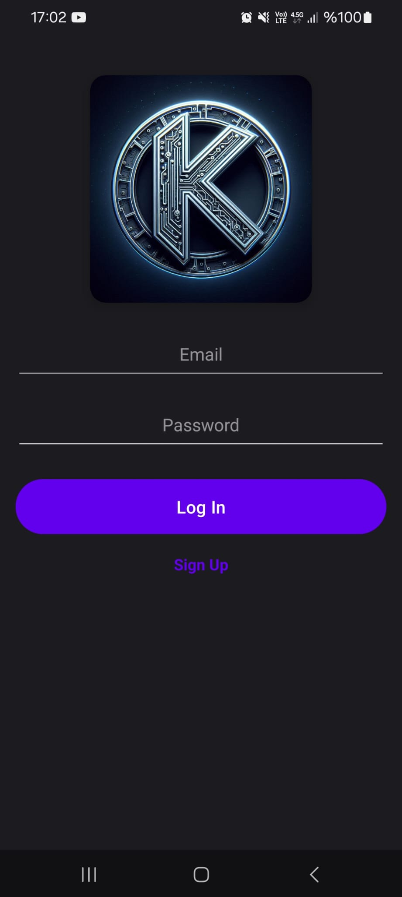
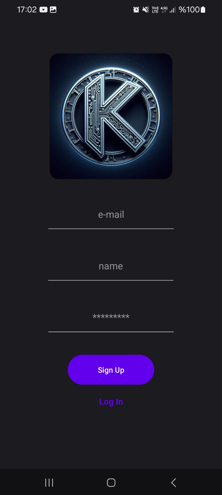
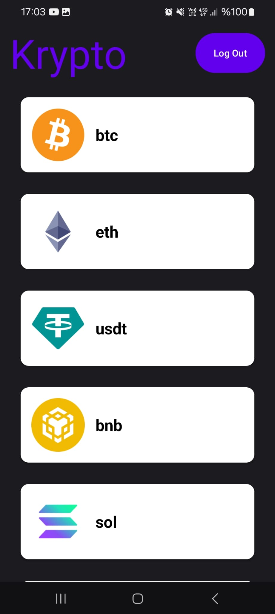
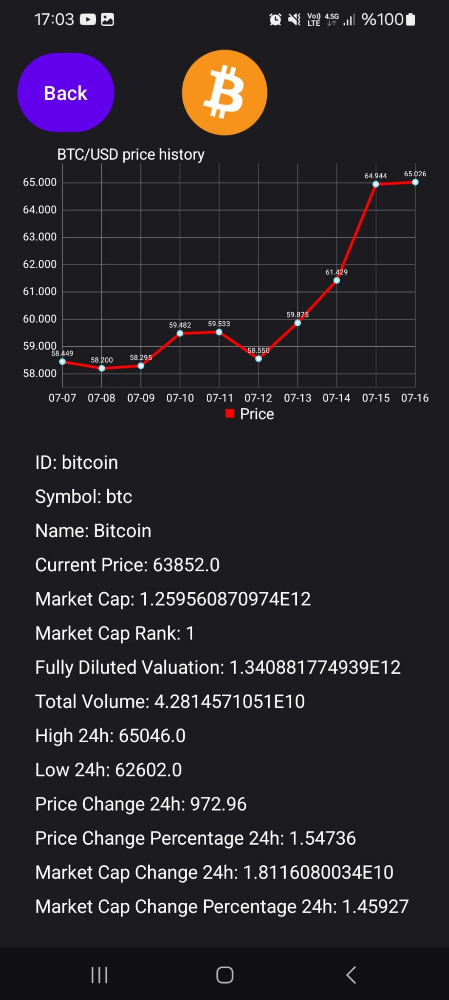
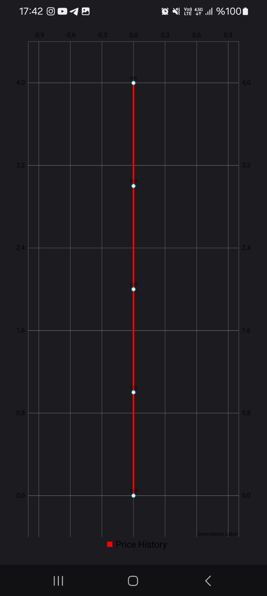

# CryptocurrencyApp

CryptocurrencyApp is an Android application that allows users to view details of various cryptocurrencies. Users can sign up and log in using Firebase Authentication. Once logged in, they can view a list of cryptocurrencies and access detailed information about each one.

## Features
- User authentication with Firebase (Sign up and Log in)
- List of cryptocurrencies
- Detailed view of selected cryptocurrency
- User-friendly interface and intuitive navigation

## Technologies Used
- Kotlin
- Android Jetpack (ViewModel, LiveData, Navigation Component)
- Firebase Authentication
- Retrofit for API calls
- RecyclerView for list display

           
            

